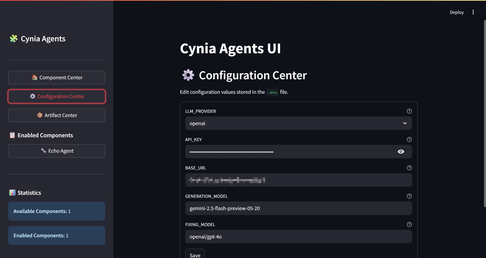

# Cynia Agents

Cynia Agents is a lightweight framework for running generative agents through a Streamlit interface.  
Generation logic lives in installable **components** which can be added or removed without modifying the UI.

The framework provides unified LLM, configuration, and artifact management, allowing agent developers to focus on building components that generate content.

The repository ships with only a simple example component.  Complex generators such as the Bukkit plugin agent can be distributed separately and dropped into the `components` folder.

## Quick Start

1. Install the Python dependencies:
   ```bash
   pip install -r requirements.txt
   ```
2. Run the UI:
   ```bash
   python -m streamlit run web.py
   ```
   The application will create a `.env` file from `.env.example` if it does not exist.
3. Configure your API keys and choose an LLM provider from the **Configuration Center** page in the sidebar.
4. Download a component and place it in the `components` folder.
   Use the **Component Center** to enable or disable installed components.
   Components may declare additional Python packages they depend on. The component developer are expected to instruct users to install these dependencies, commonly in the component's README.
   If a component fails to load because dependencies are missing it still appears in the Component Center. Use the **Install requirements** button and restart the Streamlit server to activate it.
5. Browse generated files in the **Artifact Center**.

## Developing Components

A component is a Python module placed inside the `components/` directory. Here's a minimal example of a CyniaAgents component.

```python
from component_base import BaseComponent

class MyComponent(BaseComponent):
    name = "My Generator"
    description = "Does something amazing"
    # Declare any additional packages your component depends on
    requirements = ["pandas"]

    def render(self):
        import streamlit as st
        self.logger("Rendering my component")
        st.write("Hello from my component")
```

See [COMPONENT_DEVELOPMENT.md](COMPONENT_DEVELOPMENT.md) for information on building your own generators.
Components can be a single Python file or a folder containing multiple files.


## License
Licensed under the Apache 2.0 License.
